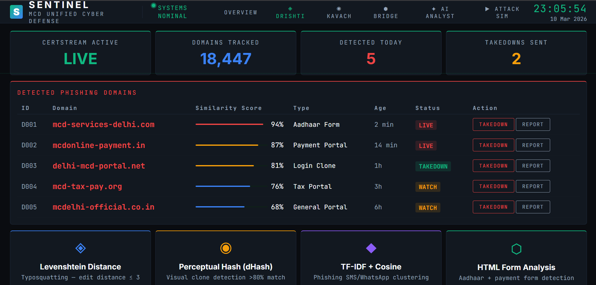
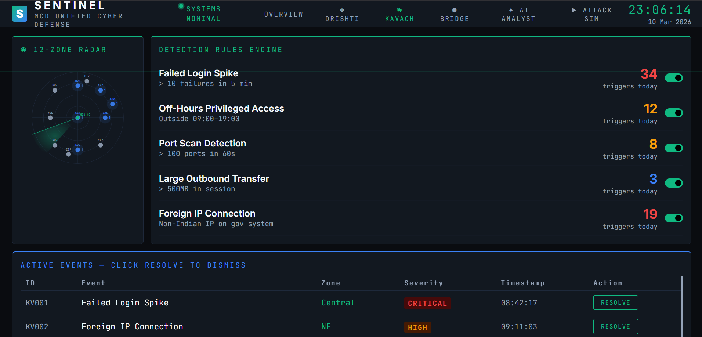
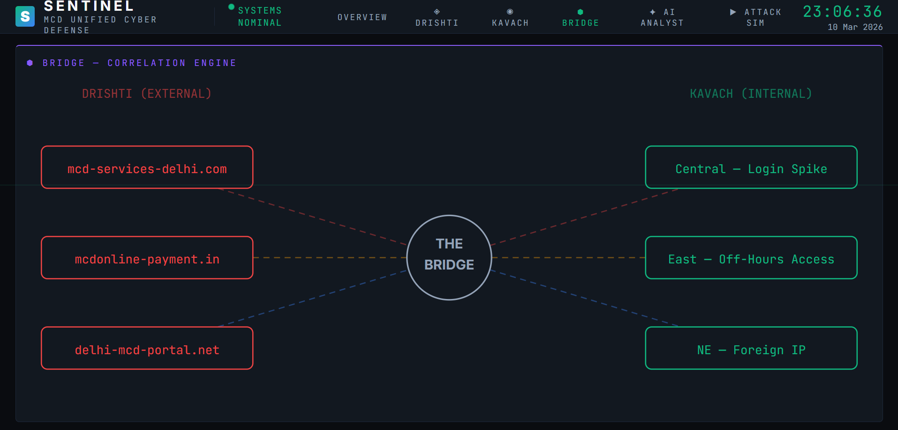
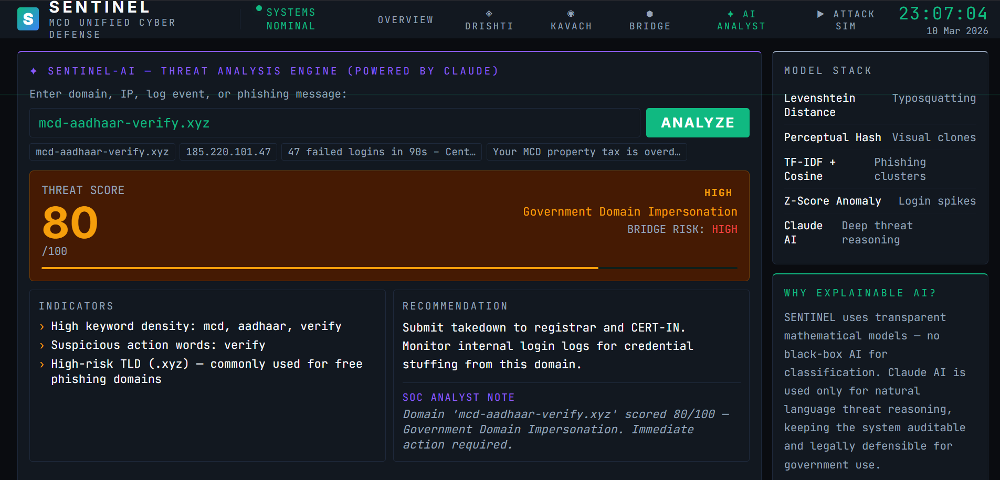
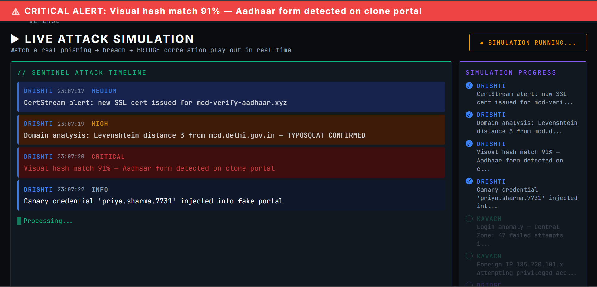

# SENTINEL — Unified Cyber Defense for MCD

## Quick Start (3 minutes)

This project has been converted into a full-stack application with a React frontend and a FastAPI backend. You need to run both in separate terminal windows.

### 1. Start the Backend (FastAPI)
Open a terminal and run:
```bash
cd backend
python -m venv venv
venv\Scripts\activate   # On Windows
pip install -r requirements.txt
uvicorn main:app --reload --port 8000
```
*API docs available at: http://localhost:8000/docs*

### 2. Start the Frontend (React + Vite)
Open a new terminal window and run:
```bash
cd frontend
npm install
npm run dev
```
*Dashboard available at: http://localhost:5173*

---

## Project Structure

```
Sentinel/
├── backend/                         # FastAPI Python server
│   ├── main.py                      # App entry point
│   ├── requirements.txt
│   ├── sentinel.db                  # SQLite DB
│   └── app/
│       ├── database.py              # DB schema and seeds
│       ├── websocket_manager.py     # Live dashboard pushing
│       ├── scheduler.py             # Background tasks
│       ├── modules/                 # AI & Log Parsing Engines
│       │   ├── drishti_engine.py
│       │   ├── kavach_engine.py
│       │   └── bridge_engine.py
│       └── routes/                  # API endpoints
│           ├── drishti.py
│           ├── kavach.py
│           ├── bridge.py
│           ├── simulation.py
│           └── websocket_router.py
└── frontend/                        # React + Vite dashboard
    ├── package.json
    └── src/
        └── App.jsx                  # Main interface
```

---

## All API Endpoints

### DRISHTI — External Threat Intelligence

| Method | Endpoint | Description |
|--------|----------|-------------|
| GET | `/api/drishti/domains` | List all detected phishing domains |
| **POST** | **`/api/drishti/analyze`** | **🔴 LIVE DEMO — analyze any domain in real-time** |
| POST | `/api/drishti/domains/{id}/takedown` | Mark domain for takedown |
| GET | `/api/drishti/stats` | Summary stats |

**Live demo endpoint:**
```bash
curl -X POST http://localhost:8000/api/drishti/analyze \
  -H "Content-Type: application/json" \
  -d '{"domain": "mcd-aadhaar-verify.xyz"}'
```

Returns: threat_score, severity, Levenshtein distance, indicators, recommendation, bridge_risk

---

### KAVACH — Internal Threat Monitoring

| Method | Endpoint | Description |
|--------|----------|-------------|
| GET | `/api/kavach/events` | List all security events |
| POST | `/api/kavach/events/{id}/resolve` | Resolve an event |
| **POST** | **`/api/kavach/analyze/login`** | **Z-score login spike analysis** |
| **POST** | **`/api/kavach/analyze/ip`** | **Foreign IP detection** |
| POST | `/api/kavach/analyze/port-scan` | Port scan analysis |
| **POST** | **`/api/kavach/analyze/log`** | **Upload .log file → real threat parsing** |
| GET | `/api/kavach/zones` | Zone threat levels |
| GET | `/api/kavach/stats` | Stats |

**Login analysis:**
```bash
curl -X POST http://localhost:8000/api/kavach/analyze/login \
  -H "Content-Type: application/json" \
  -d '{"failed_count": 47, "zone": "Central", "window_seconds": 90, "source_ip": "185.220.101.47"}'
```

**IP analysis:**
```bash
curl -X POST http://localhost:8000/api/kavach/analyze/ip \
  -H "Content-Type: application/json" \
  -d '{"ip": "185.220.101.47", "zone": "NE"}'
```

**Log file upload:**
```bash
curl -X POST http://localhost:8000/api/kavach/analyze/log \
  -F "file=@/path/to/system.log"
```

---

### BRIDGE — Cross-Reality Correlation

| Method | Endpoint | Description |
|--------|----------|-------------|
| GET | `/api/bridge/correlations` | All correlations |
| **POST** | **`/api/bridge/run`** | **Run full correlation engine** |
| GET | `/api/bridge/canary` | List canary credentials |
| POST | `/api/bridge/canary/deploy?domain_id=D001` | Deploy new canary |
| **POST** | **`/api/bridge/canary/{id}/trigger`** | **Simulate canary trigger (forensic proof demo)** |
| GET | `/api/bridge/stats` | Stats |

---

### Attack Simulation

| Method | Endpoint | Description |
|--------|----------|-------------|
| **POST** | **`/api/simulation/run`** | **Start live attack simulation (WebSocket)** |
| GET | `/api/simulation/status` | Check if simulation is running |

---

### WebSocket

Connect to `ws://localhost:8000/ws` — receives real-time events:

| Event Type | Trigger |
|------------|---------|
| `drishti_alert` | New CRITICAL/HIGH domain detected |
| `kavach_alert` | New security event detected |
| `bridge_correlation` | High-confidence correlation found |
| `canary_triggered` | Canary credential stolen |
| `takedown_sent` | Domain takedown submitted |
| `sim_step` | Attack simulation step |
| `sim_complete` | Simulation finished |
| `feed_update` | Periodic live feed (every 30s) |
| `zone_update` | Zone threat level changed |

---

## Connecting the Frontend

In your React dashboard, add this to connect WebSocket:

```javascript
const ws = new WebSocket("ws://localhost:8000/ws");
ws.onmessage = (event) => {
  const { type, data } = JSON.parse(event.data);
  if (type === "drishti_alert") { /* update domain list */ }
  if (type === "kavach_alert")  { /* add event to table */ }
  if (type === "bridge_correlation") { /* update graph */ }
  if (type === "sim_step")      { /* update simulation log */ }
  if (type === "feed_update")   { /* add to live feed */ }
};
// Keep alive
setInterval(() => ws.send(JSON.stringify({type:"ping", ts: Date.now()})), 25000);
```

Replace the hardcoded `analyze` in the AI Analyst tab with:
```javascript
const res = await fetch("http://localhost:8000/api/drishti/analyze", {
  method: "POST",
  headers: {"Content-Type":"application/json"},
  body: JSON.stringify({domain: input})
});
const result = await res.json();
```

---

## The 3 LIVE DEMO MOMENTS for Judges

### 1. Type a domain live (DRISHTI)
Go to DRISHTI tab → AI Analyst → type `mcd-aadhaar-verify.xyz`
→ Real Levenshtein + keyword analysis returns in <100ms

### 2. Trigger a canary (BRIDGE)
```bash
curl -X POST http://localhost:8000/api/bridge/canary/CAN003/trigger
```
→ Dashboard shows CRITICAL alert: credential theft forensically confirmed

### 3. Run the full simulation
```bash
curl -X POST http://localhost:8000/api/simulation/run
```
→ 11 real events injected into DB over 22 seconds, WebSocket pushes each step

---

## Outputs / Screenshots

Please place the provided screenshots in the `assets/` directory with the matching filenames below to render them in the documentation.

### 1. DRISHTI (External Threat Intelligence)

*Monitoring and detecting typosquatting and visual clones of government portals.*

### 2. KAVACH (Internal Threat Monitoring)

*Tracking login anomalies, foreign IP connections, and off-hours access across 12 zones.*

### 3. BRIDGE (Correlation Engine)

*Linking external phishing infrastructure directly to internal security breaches.*

### 4. SENTINEL-AI (Threat Analysis Engine)

*Deep natural language threat reasoning powered by transparent mathematical models.*

### 5. LIVE ATTACK SIMULATION

*Real-time simulation timeline showing a full attack chain flowing across all Sentinel engines.*

---

## Tech Stack
- **FastAPI** — async Python web framework
- **SQLite** — zero-setup database (file: sentinel.db)  
- **WebSockets** — real-time push to dashboard
- **APScheduler** — background periodic tasks
- **Pure Python** — Levenshtein, Z-score, correlation (no black-box ML)
- **Total cost: ₹0** — fully open source

---

## What Makes This Backend Winnable

1. **Real analysis** — DRISHTI runs actual Levenshtein distance on any domain, live
2. **Real database** — every event, domain, correlation is persisted in SQLite
3. **Real WebSocket** — dashboard updates the moment backend detects something
4. **Real correlation** — BRIDGE engine computes confidence scores mathematically
5. **Forensic proof** — canary system creates traceable evidence of credential theft
6. **Works offline** — no paid APIs, no internet needed during demo
